# Reading Vault

Read EPUB and PDF books inside your Obsidian vault. Everything you highlight becomes a real note, and with Pro you can link it to your own Topic notes, so your reading ends up in the same place as the rest of your thinking.

I built Reading Vault because I wanted my books, my highlights and my notes in one place, as plain files I own. No separate app, no account, no hidden database: every book, highlight and saved word is an ordinary Markdown note in your vault.

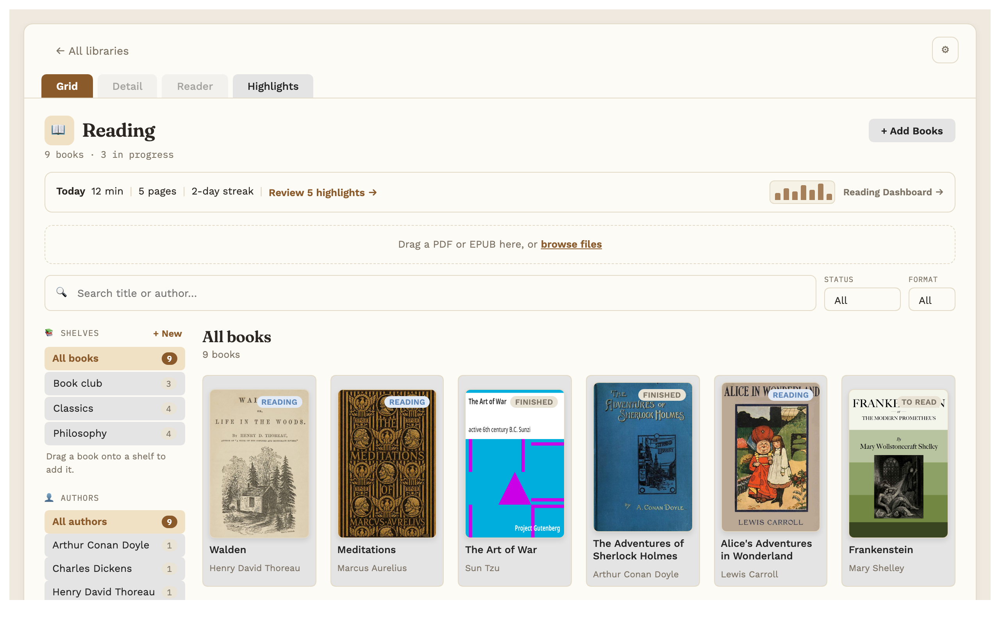

**Reading Vault is free.** Some features need a one-time **Reading Vault Pro** purchase ($19 at launch, going up to $29 later). See [Free and Pro](#free-and-pro) below.

## What it does

- **A library for your books.** Add EPUB and PDF files by dragging them in. Title, author and cover fill in on their own. Search, filter by status or format, browse by author, and sort books onto your own shelves.
- **Add sample books.** Nothing in your Library yet? One button adds four free classics (Meditations, Pride and Prejudice, The Adventures of Sherlock Holmes, Walden), so there's something to read, highlight and listen to right away. Free for everyone.
- **One reader for EPUB and PDF.** Real pages, a table of contents, search inside the book, bookmarks, and it opens where you left off. Choose the font, text size, line spacing and margins, with a light, dark or automatic page.
- **Highlights that become notes.** Select text, pick one of five colours, add a note. Each book's own note lists its highlights, with links that jump straight back to the exact spot.
- **Listen.** Have the book read aloud with your computer's built-in voices, sentence by sentence, with the page turning as it goes. Works for PDFs too.
- **Natural voices (Pro).** 28 natural-sounding English voices (American and British) that sound much closer to a person reading. They run on your own computer, offline, after a one-time download.
- **Audiobook mode (Pro).** Turn any book into an audiobook: each word lights up as it's read, listening keeps going across pages and chapters, and a sleep timer pauses it and keeps your place.
- **Word lookup.** Select a word for its meaning, from an English dictionary you download once and use offline.
- **Full screen reading.** Just the page, nothing else on screen.
- **Your files stay yours.** Choose which folders it uses. Uninstall it and every note is still there, readable in Obsidian or any text editor.

## Screenshots

The reader, with a highlight and the progress strip (time left in the chapter and the book):

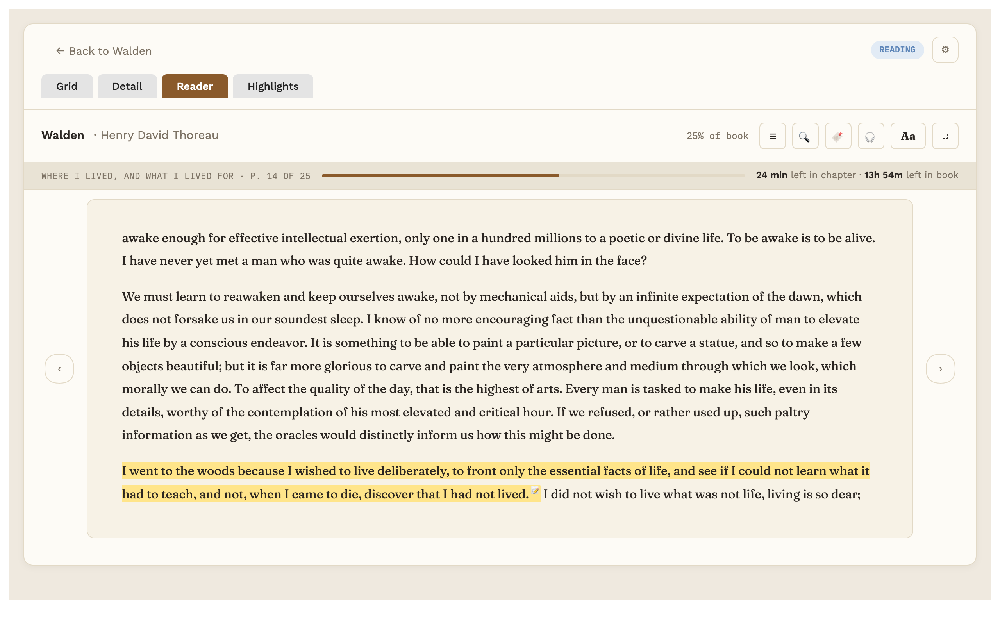

Highlights for the book beside the page:

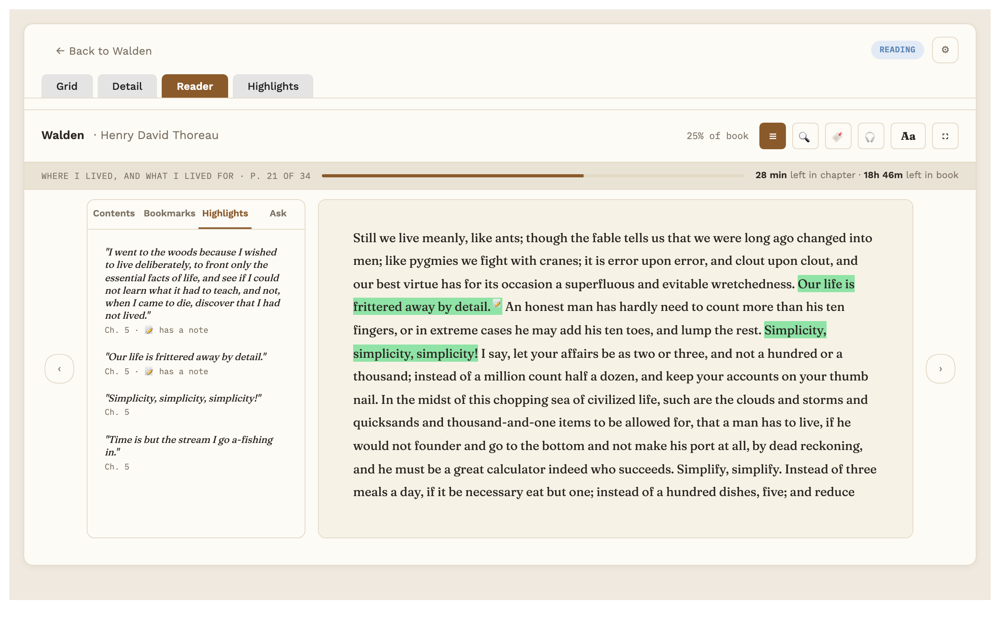

A book's page: cover, shelves, and every highlight with its note (summary and linked Topic are Pro):

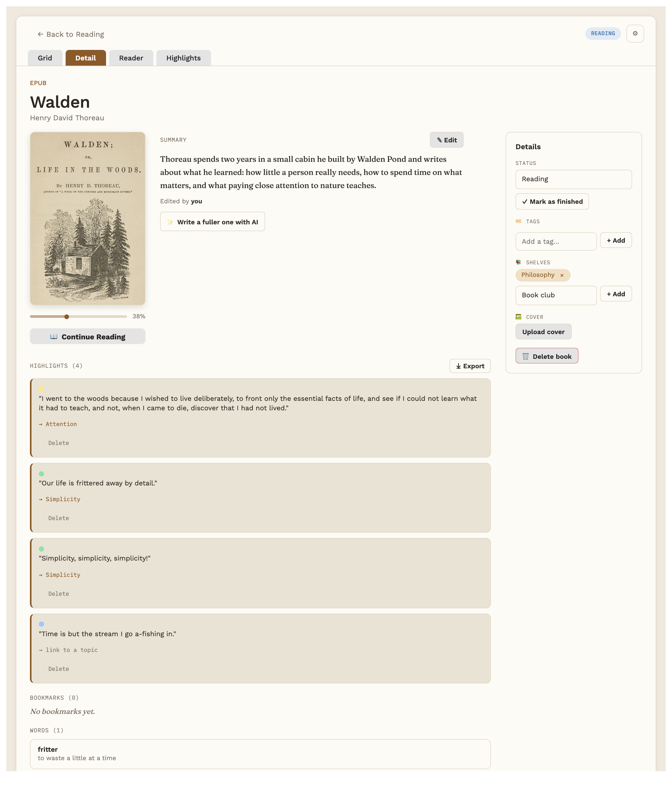

Word lookup, from an offline dictionary:

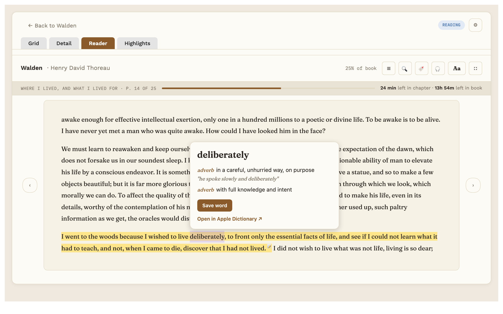

Shelves:

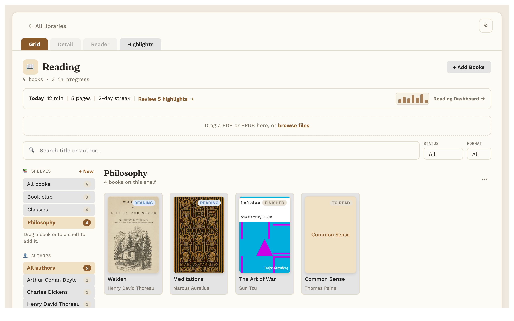

Full screen reading, here with a dark page:

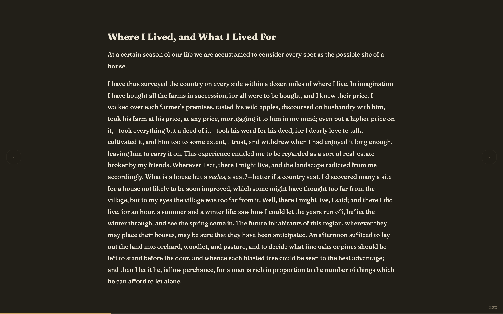

Pro: ask a question about the book you're reading, answered from your own highlights, notes and the current chapter, with numbered sources:

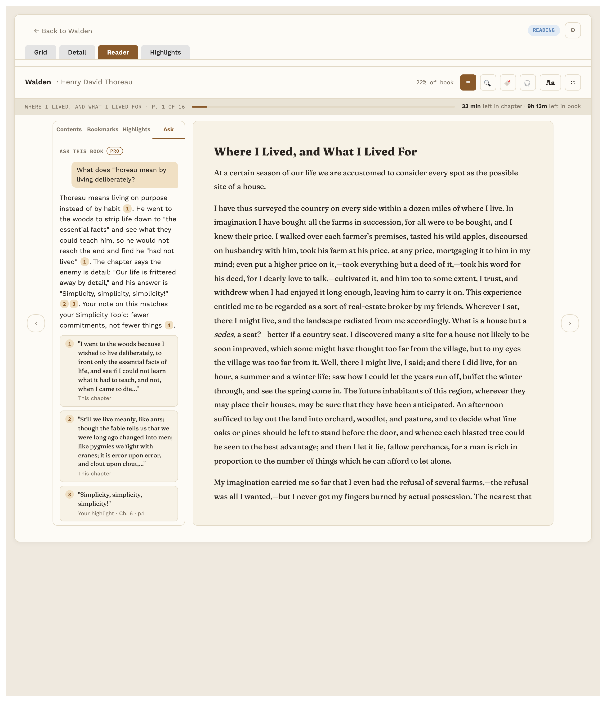

Pro: the reading dashboard, with goals, streaks and charts:

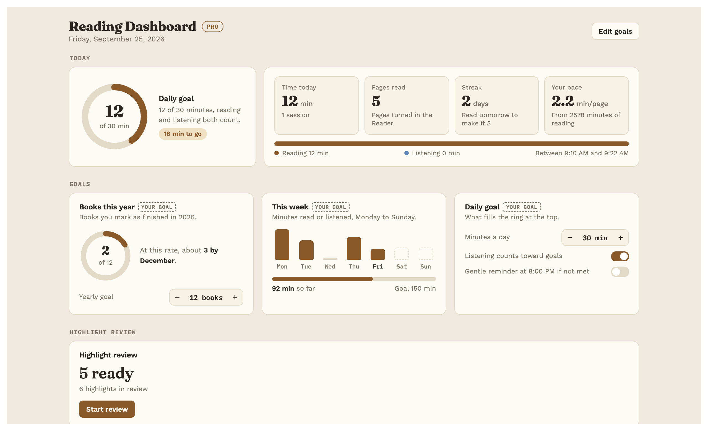

Pro: highlight review brings a few of your linked highlights back each day:

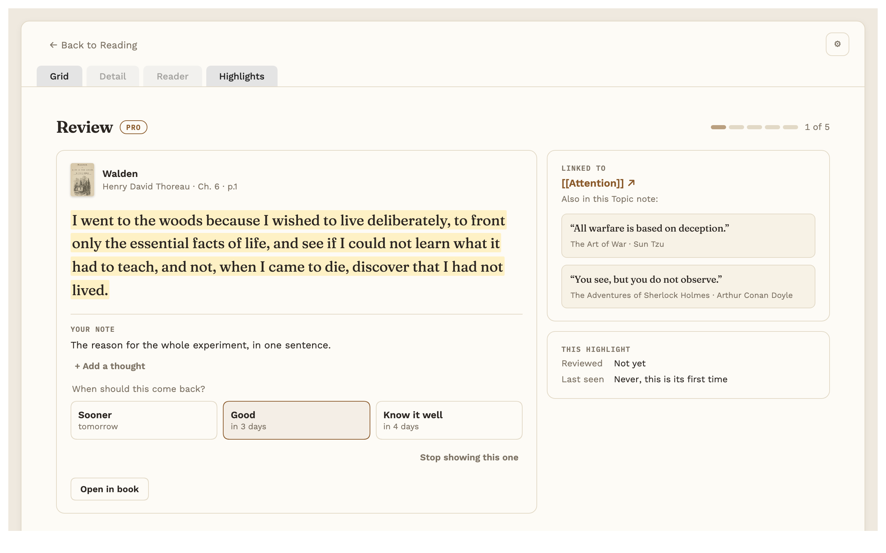

Everything also works with a dark theme:

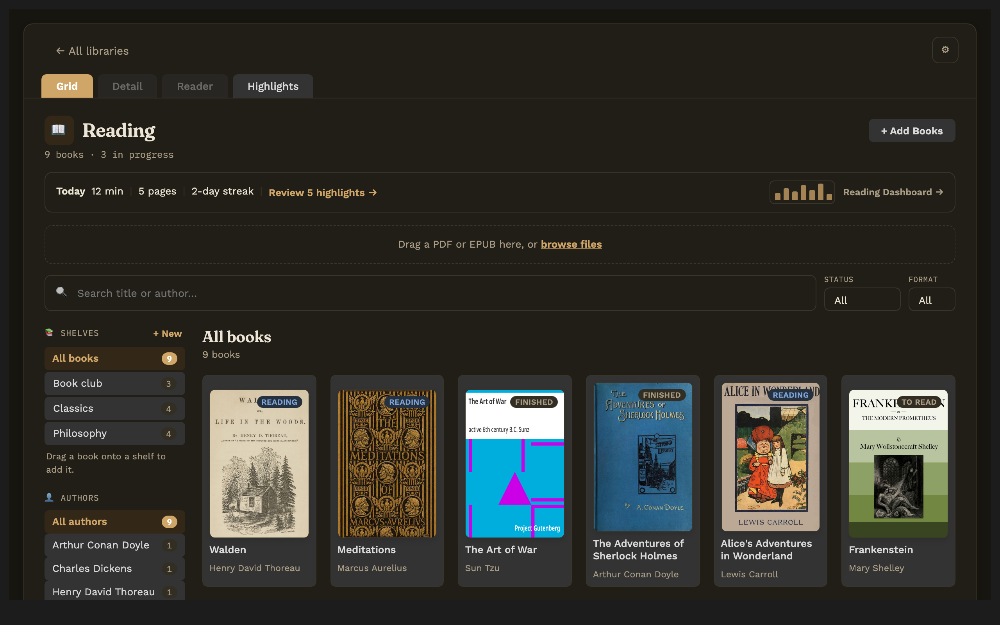

The books in these screenshots are public-domain books from Project Gutenberg. The notes, highlights and reading history are made up for the pictures, and the "Ask" answer shown is a written example, not a live AI reply.

## Free and Pro

Payment is required for full access: the features marked Pro below unlock with a one-time Reading Vault Pro key. Everything else is free, with no time limit.

| Feature | Free | Pro |
|---|:---:|:---:|
| Library: covers, search, filters, authors | ✓ | ✓ |
| Shelves | ✓ | ✓ |
| Add sample books (four free classics, for trying it out) | ✓ | ✓ |
| Choose your own folders | ✓ | ✓ |
| EPUB and PDF reader, contents, search, bookmarks | ✓ | ✓ |
| Text settings and light, dark or automatic page | ✓ | ✓ |
| Reading progress and time left | ✓ | ✓ |
| Full screen reading | ✓ | ✓ |
| Highlights in five colours, with notes | ✓ | ✓ |
| Highlights listed in each book's note | ✓ | ✓ |
| Listen with your computer's built-in voices | ✓ | ✓ |
| Natural voices: 28 English voices, offline after one download |  | ✓ |
| Audiobook mode: word-by-word highlighting, keeps going across chapters, sleep timer |  | ✓ |
| Word lookup (offline dictionary) | ✓ | ✓ |
| Today's reading line in the library | ✓ | ✓ |
| Export highlights: preview | ✓ | ✓ |
| Export highlights: save to a file or copy |  | ✓ |
| Link highlights to Topic notes |  | ✓ |
| Save looked-up words as notes |  | ✓ |
| Book summaries, including "Write with AI" |  | ✓ |
| Ask the book (AI, uses your own AI account) |  | ✓ |
| Explain a word in its sentence (AI, uses your own AI account) |  | ✓ |
| Reading dashboard: goals, streaks, charts |  | ✓ |
| Highlight review |  | ✓ |

Inside the plugin, Pro features carry a small "Pro" tag, and Settings has a "Get Pro" section with a Buy Pro button that opens the store page. That's the only promotion in the plugin, and nothing in it is loaded from the internet.

## Buy Pro

**[Buy Reading Vault Pro](https://payhip.com/WorkbenchGoods)** ($19 at launch, one-time, going up to $29 later).

- One payment, no subscription. Every future update is included.
- Your key arrives by email right after purchase. Paste it into Settings → Reading Vault → Reading Vault Pro.
- The key is checked on your own computer, offline. Nothing is sent anywhere to check it.
- The AI features (Ask the book, "Write with AI" summaries, explaining a word) use your own account with Anthropic, OpenAI or OpenRouter. That provider bills you separately for what you use.

**Refunds:** if Reading Vault Pro doesn't work for you, email me at jhesch@gmail.com within 14 days for a full refund. Refunded keys are switched off in the next update.

## What goes online, and why

Reading Vault works offline. It never sends anything about you or your reading anywhere on its own, and it has no tracking or analytics. These are the only times it connects to the internet, all started by you:

- **Ask the book, "Write with AI" summaries and "Explain in this sentence" (Pro).** These are off until you switch them on in Settings and add a key for the AI service you choose: Anthropic (api.anthropic.com), OpenAI (api.openai.com) or OpenRouter (openrouter.ai). Your key is kept in Obsidian's own secure storage, not in the plugin's settings file. Only then, and only when you ask, the plugin sends that service:
  - for Ask: your question, the book's title and author, the highlights and notes from this book, the Topic notes they link to, and the text of the chapter you're on (never the whole book). Each of these can be switched off in Settings, and "What was sent" under every answer shows exactly what went.
  - for a summary: the book's title, author, the description inside the book file, and its chapter titles (not the book's text).
  - for explaining a word: the word, the sentence it's in, and the book's title and author.
  - The "Test" button next to a key, and the list of models to choose from, also ask that service to check your key and list its models.
- **Word lookup dictionary.** When you press Download in Settings → Word lookup, the English dictionary (made from Princeton WordNet, about 6 MB) is downloaded once from the public GitHub repository [B0xfan/a4-reading-dictionaries](https://github.com/B0xfan/a4-reading-dictionaries), checked, and saved on your computer outside your vault. After that, lookups are offline.
- **Buy Pro.** The Buy Pro button opens the store page in your web browser.
- **Natural voices (Pro).** When you press Download in Settings → Reading Vault, the voice model (about 325 MB, once) and each voice you use (about half a megabyte) are downloaded from Hugging Face (huggingface.co, the public Kokoro-82M files, Apache-2.0 licence), together with English pronunciation lists (about 3 MB) from the public GitHub repository [B0xfan/reading-vault-voices](https://github.com/B0xfan/reading-vault-voices). Each file is checked against a fingerprint built into the plugin, then saved on your computer outside your vault, in `Library/Application Support/a4-reading-kokoro` in your home folder on a Mac, or `AppData\Roaming\a4-reading-kokoro` on Windows (so it doesn't sync or get backed up with your notes). After that, listening is offline and your books' text never leaves your computer. The voice engine itself is inside the plugin; it is never downloaded.
- **Voice samples.** Pressing ▶ next to a natural voice in Settings plays a short sample clip (about 30 KB) from the same public repository, [B0xfan/reading-vault-voices](https://github.com/B0xfan/reading-vault-voices). It's checked the same way and kept in that same folder, so it plays without the internet next time. This works with or without Pro, and doesn't need the voice model.
- **Add sample books.** When you press "Add sample books" (in an empty Library, or the first-run welcome), four EPUB files (about 3 MB total) are downloaded once from the public GitHub repository [B0xfan/a4-reading-sample-books](https://github.com/B0xfan/a4-reading-sample-books), checked, and added to your Library as regular books. They're free, public-domain editions from [Standard Ebooks](https://standardebooks.org/). Free for everyone.

"Open in Apple Dictionary" (on a Mac) opens the dictionary app on your computer; it doesn't go online.

## Install

Reading Vault needs Obsidian on a computer (it's tested on a Mac; it doesn't run on phones yet). Obsidian 1.4 or later; the AI features need Obsidian 1.11.4 or later for its secure key storage.

**From Obsidian (once it's listed):** Settings → Community plugins → Browse, search for "Reading Vault", then Install and Enable.

**By hand:**

1. Download `main.js`, `manifest.json` and `styles.css` from the latest [release](https://github.com/B0xfan/reading-vault/releases).
2. Put them in a folder called `reading-vault` inside your vault's `.obsidian/plugins/` folder.
3. In Obsidian: Settings → Community plugins, turn on Reading Vault.

Then click the book icon in the left ribbon, or run "Reading Vault: Open library" from the command palette, and drag a book in.

## Where your things go

By default, book notes go in a `Reading` folder (with `Highlights` and `Words` inside), Topic notes in `Topics`, and the book files and covers in `Reading/Files`. You can change all three in Settings → Reading Vault → Folders; if a folder already has things in it, the plugin asks before moving anything, and links are kept up to date.

## Support

Questions, problems or ideas: email me at jhesch@gmail.com.

## Licence

Reading Vault's source is public so you can read exactly what it does. It's licensed under the [PolyForm Shield License 1.0.0](LICENSE). In plain words:

- You can use it for anything, including at work and for commercial purposes.
- You can read the code and change your own copy.
- You can't use the code to offer a product that competes with Reading Vault or Reading Vault Pro. That includes publishing a copy with Pro unlocked, even for free.

The licence text is the part that counts; this summary isn't legal advice.

Reading Vault includes some open-source parts (the natural-voice engine) under the Apache 2.0 and MIT licences; they're listed, with their licence texts, in [THIRD-PARTY-NOTICES.md](THIRD-PARTY-NOTICES.md). None of them is under the GPL.

The fonts bundled in `styles.css` (Fraunces, Work Sans, IBM Plex Mono, Atkinson Hyperlegible) are under the SIL Open Font License 1.1; see [`fonts/`](fonts/).
