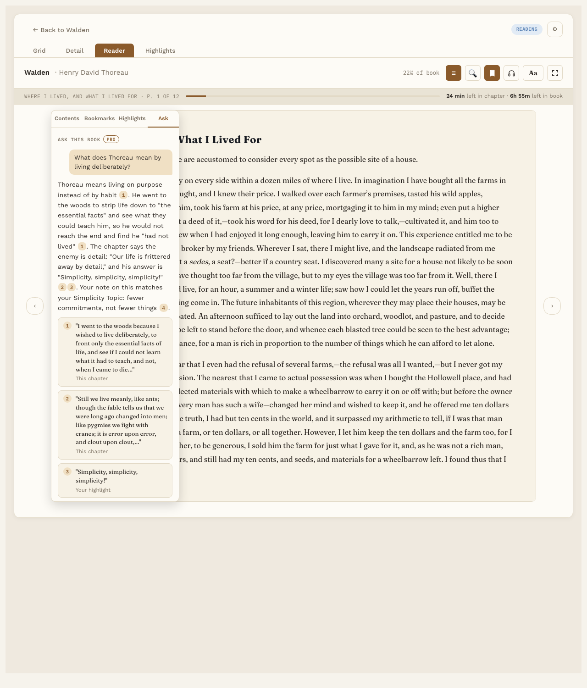

# Ask the book

**Pro.** Part of Reading Vault Pro.

Ask a question about the book you're reading and get an answer built from your own highlights and notes, and the chapter you're on. Every point in the answer shows where it came from.

## Before you start

Ask uses an AI service that you sign up for yourself. You pay that service directly, usually a few cents per question. You'll need:

- An account and a key from **Anthropic**, **OpenAI** or **OpenRouter**. A key is a long code the service gives you.
- Obsidian 1.11.4 or newer. Reading Vault keeps your key in Obsidian's own secure storage, never in a settings file.

## Set it up

This takes about 5 minutes.

1. Go to Settings, then Reading Vault, then **Ask the book**.
2. Turn on **Turn on Ask**.
3. Paste your key in the box for your service.
4. Press **Test** to check it works. This also loads the list of models.
5. Under **Which service answers**, pick your service. Under **Model**, pick a model.

## Ask a question

1. Open a book in the Reader.
2. Press **☰** and pick the **Ask** tab.
3. Type your question and send it.

The answer numbers each point. The numbers match source cards underneath: a passage from the chapter, one of your highlights, your note, or a Topic note. Click a highlight card to jump to it, or a Topic card to open that note.

Under each answer you can:

- **Copy** it.
- **Save to book note.** Adds the question and answer to the book's note, under a "Questions" heading.
- See **What was sent**, so you know exactly what went to the AI service.

## What gets sent

You decide, in Settings:

- **Send my highlights and notes** from this book.
- **Send linked Topic notes.**
- **Send the chapter I'm on.** For a PDF, that's the pages around the one you're on.

The whole book is never sent.

## Good to know

- Nothing goes online until you turn on Ask and add a key. See [Your files and privacy](your-files-and-privacy.md).
- Each answer shows which model answered and roughly what it cost.
