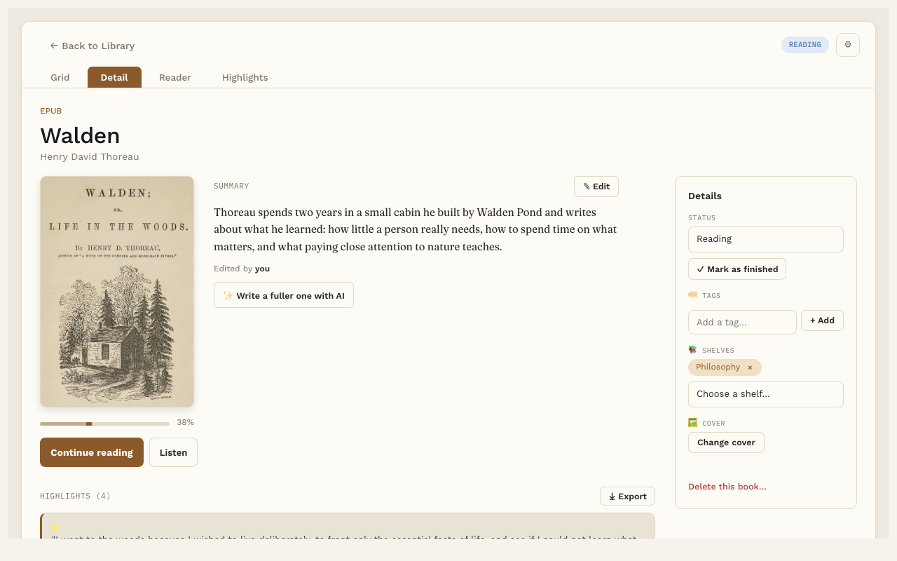
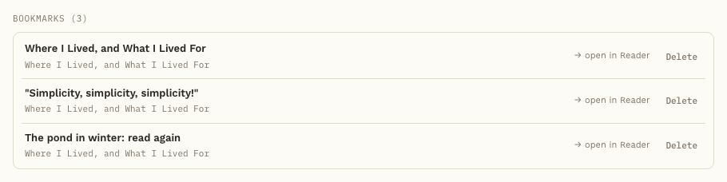
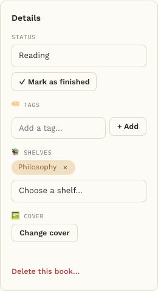

# A book's page

**Free.** Everyone gets this.

Each book has its own page, on the **Detail** tab. It's where you see your progress, change the status, and find everything you've saved from the book.

## What's on the page

- **The cover, title and author,** with a bar showing how far you've read.
- **Start reading** or **Continue reading.** This opens the book right where you left off. **Listen**, next to it, opens the book and starts reading it aloud.
- **Summary.** A short summary of the book, beside the cover. This is part of Pro. See [AI book summary](book-summary.md).
- **Notes.** Your own thoughts about the whole book. See [Notes](notes.md).
- **Highlights.** Every passage you've highlighted in this book. Click one to jump to it in the Reader.
- **Bookmarks.** Every bookmark in this book, with its chapter underneath. Click one to open the book at that page, or press **Delete** beside it to remove it (it asks first).

  

- **Words.** Words you've saved from this book (with Pro).

## The Details box

On the right side you'll find:

- **Status.** To Read, Reading, Finished or Abandoned.
- **✓ Mark as finished.** One click sets the status to Finished and remembers the date. Finished books count toward your yearly goal on the [Reading Dashboard](reading-dashboard.md).
- **Tags.** Add or remove tags for the book.
- **Shelves.** Put the book on a shelf, or take it off. See [Shelves](shelves.md).
- **Upload cover** (or **Change cover** once the book has one). Pick your own cover image. A PDF gets a cover made from its first page when you add it (or the first time you open it); you can replace it here.
- **Delete this book….** At the bottom of the Details box. Removes the book, its file, its cover and its highlights, after you confirm.

## Good to know

Everything on this page is saved in the book's own note in your vault. You can open that note in Obsidian any time.
