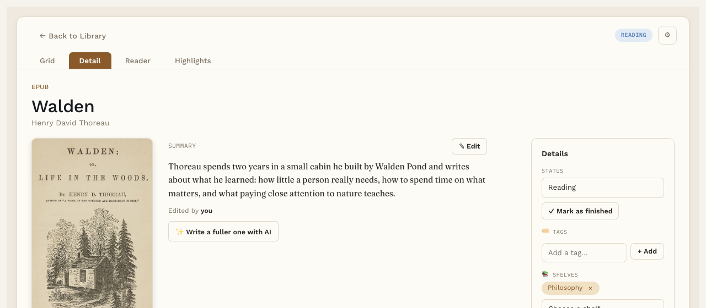

# AI book summary

**Pro.** Part of Reading Vault Pro.

With Pro, each book's page shows a short summary beside the cover. It can come from the book itself, from AI, or from you.

## Where summaries come from

- **The book's own description.** Most EPUBs carry the publisher's description. A new book brings it in by itself. For a book you added earlier, press **Use the book's description**.
- **✨ Write with AI.** Writes a short summary from the book's title, its description and its chapter titles. It never sends the book's text, and it avoids spoilers. It uses the same AI service and key as [Ask the book](ask-the-book.md).
- **Write my own.** Type your own summary.

A small line under the summary says where it came from: the book, AI with the date, or you.

## Change a summary

Press **✎ Edit**, change the text, and save. A long summary is cut short with **Show more**.

## Good to know

The summary is saved in the book's own note, under a "Summary" heading, so it's yours to keep.
