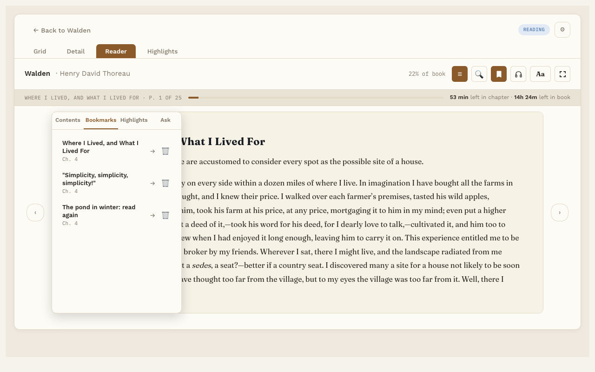

# Bookmarks

**Free.** Everyone gets this.

A bookmark saves a page you want to come back to. Your reading place is saved on its own, so bookmarks are for everything else.

## Add a bookmark

Press **🔖** in the Reader toolbar. That's it. The bookmark is named from the first few words on the page, plus the page number.

## Remove a bookmark

There are three ways:

- Go to the page and press **🔖** again. Each page has one bookmark at most.
- In the Reader, press **☰**, pick the **Bookmarks** tab, and press **🗑** beside the bookmark. It goes straight away.
- On the book's page, press **Delete** beside the bookmark in the Bookmarks list. It asks "Delete bookmark?" first; press **Delete** to remove it or **Cancel** to keep it. The book and your highlights are not affected.

## Rename a bookmark

1. Press **☰** and pick the **Bookmarks** tab.
2. Click the bookmark's name.
3. Type a new name and press Enter.

## Go to a bookmark

- In the Reader, press **☰**, pick **Bookmarks**, and click one.
- On the book's page, click a bookmark in the Bookmarks list. The book opens right at that page. Under each bookmark you see the chapter it's in.

After a jump, press **↩ Back to p. N** to return to where you were reading.
