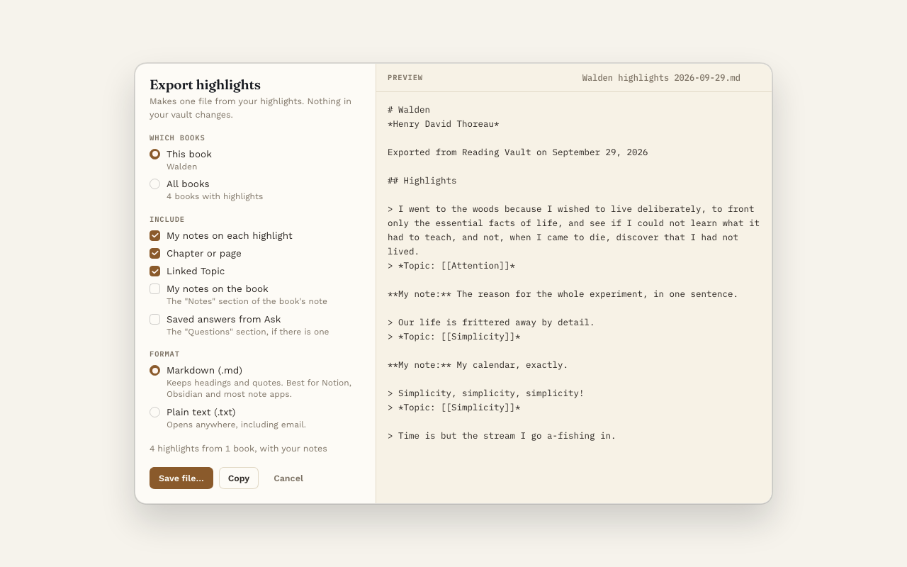

# Export highlights

**Pro.** Part of Reading Vault Pro.

Export puts your highlights into one tidy file, ready to share, print or paste somewhere else.

## Open it

- On a book's page, press **⤓ Export** next to the Highlights heading.
- On the Highlights tab, press **⤓ Export** to export from all your books.
- Or use the command "Export highlights".

## Choose what goes in

- **This book or All books.**
- **What to include:**
  - My notes on each highlight
  - Chapter or page
  - Linked Topic
  - My notes on the book
  - Saved answers from Ask
- **Format:** Markdown or plain text.

The preview on the right shows exactly what the file will look like as you change things.

## Save it

- **Save file…** opens your computer's own save window, so you pick where the file goes.
- **Copy** puts the whole thing on your clipboard, ready to paste.

## Good to know

- Highlights come out in the order they appear in the book.
- Dismissed highlights are left out.
- Without Pro, you can still open the window and see the preview. Your highlights are always in your vault as notes anyway.
