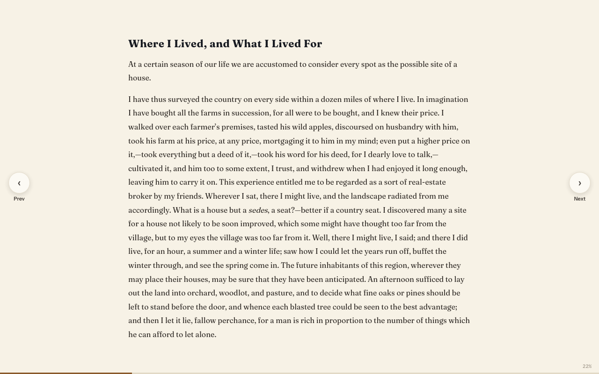

# Full screen

**Free.** Everyone gets this.

Full screen fills your whole screen with just the book. Obsidian's sidebars, tabs and toolbar all step out of the way.

## Go full screen

- Press the **Full screen** button at the end of the Reader toolbar.
- Or use the command "Open in full screen". You can give it a hotkey in Obsidian's settings.

## While you read

- A short hint shows when you enter: "Press Esc to exit · ← → to turn pages".
- Turn pages with the **Prev** and **Next** arrows at the sides, or the arrow keys.
- A thin line at the bottom shows your progress.
- **Move the mouse to the top** of the screen. A slim bar appears with the book, chapter and page, the usual Reader buttons, and **Exit**.
- While Listen is playing, a small bar at the top shows the voice, back, pause, forward and speed.

## Leave full screen

Press **Esc**, or move the mouse: a small **Exit full screen** button shows in the top corner while it moves. The slim bar at the top has **Exit** too. If a pop-up or side panel is open, the first Esc closes just that. Press Esc again to leave full screen.

## Good to know

- Books always open in the normal Reader. Full screen isn't remembered.
- Obsidian's own small messages can't show over full screen. They wait until you leave.
