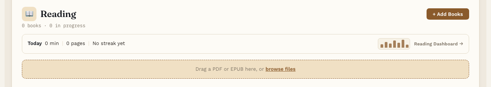

# Getting started

**Free.** Everyone gets this.

This page takes about 5 minutes. By the end you'll have your first book open.

## Open Reading Vault

1. Look for the open book icon in the ribbon on the left side of Obsidian.
2. Click it. Reading Vault opens in a new tab.

You can also open it from the command palette. Press Cmd+P (Ctrl+P on Windows), type "Open library", and press Enter.

## Add your first book

Reading Vault reads two kinds of book files:

- **EPUB** is the usual ebook file. Most ebook stores and free libraries offer it.
- **PDF** is the page-by-page file you often get for papers, manuals and scanned books.

To add one:

1. Drag the file onto the box that says "Drag a PDF or EPUB here".
2. Or press **+ Add Books** and pick the file.

Reading Vault fills in the title, the author and the cover for you, when the file has them. You can add several books at once.

Don't have a book handy? Press **Add sample books** instead (it's on the same screen, and on the welcome you see the very first time) for four free classics you can start reading right away. See [Your Library](library.md).

## Open the book

Click the book's cover. That opens the book's own page. Press **Start reading** to begin.

## The four tabs

Across the top of Reading Vault you'll see four tabs:

- **Grid** is your Library, with all your books.
- **Detail** is the page for the book you picked.
- **Reader** is where you read.
- **Highlights** lists the passages you've highlighted.

## What next

- Learn your way around the [Reader](reading.md).
- Try making a [highlight](highlights.md).
- Have a page read aloud with [Listen](listen.md).
