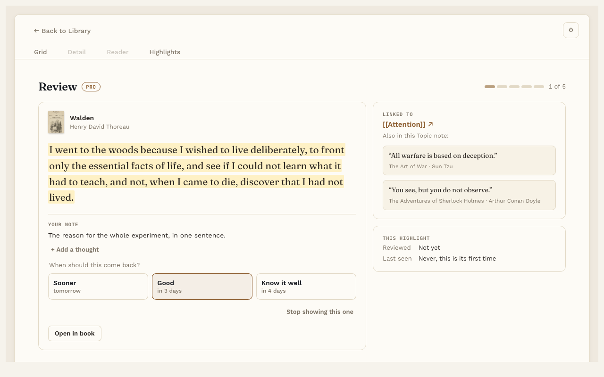

# Highlight review

**Pro.** Part of Reading Vault Pro.

Most highlights get made and then forgotten. Highlight review brings a few of your linked highlights back each day, so the ideas stick.

## Start a review

When highlights are ready, the Today line at the bottom of the Library shows **Review N highlights →**. Press it. You can also use the command "Review highlights", or the card on the [Reading Dashboard](reading-dashboard.md).

A review takes about 2 minutes.

## How it works

You see one highlight at a time, with the Topic it's linked to and your note on it. After reading it, pick one:

- **Sooner.** Bring it back soon.
- **Good.** Bring it back in a while.
- **Know it well.** Bring it back much later.

Or press **Stop showing this one** to take it out of review for good.

## Add a thought

Press **+ Add a thought** to write something new about the passage. Press **Save**, and it's added to the highlight's own note.

## Settings

In Settings, under **Highlight review**:

- **Highlights per day.** How many come back each day. The default is 5. Anything you don't get to waits for tomorrow, so it never piles up.
- **Remember first.** Hides the passage until you tap it, so you can try to recall it first.

## Good to know

Only highlights you've [linked to a Topic note](topic-links.md) come back in review.
