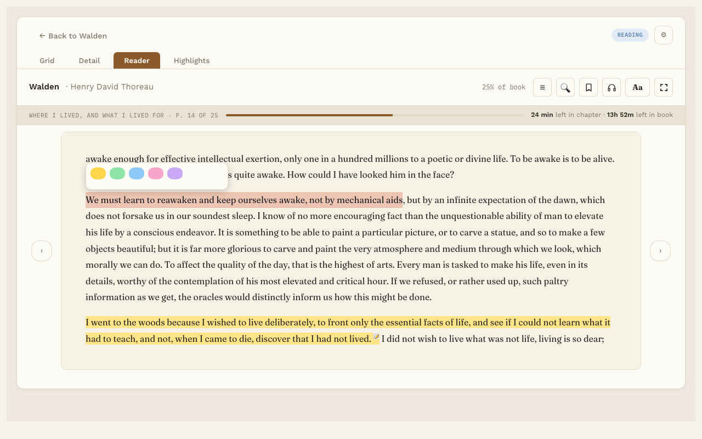
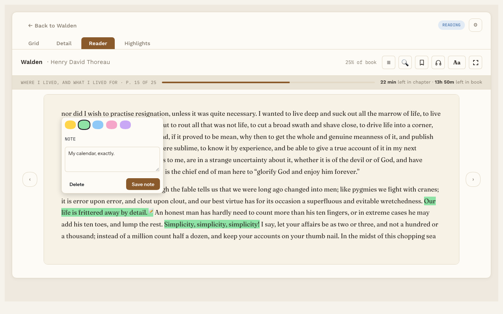

# Highlights

**Free.** Everyone gets this.

Highlight a passage to keep it. Each highlight becomes its own note in your vault, with the passage, its color and your note on it.

## Make a highlight

1. Select some text on the page with your mouse.
2. Pick a color: Yellow, Green, Blue, Pink or Lavender.

This works in EPUB and PDF books.

While Listen is reading, press **H** to save the sentence you're hearing as a highlight.

## Change or delete a highlight

Click the highlighted text. A small panel opens where you can:

- Pick a new color.
- Write a **Note** about this passage, then press **Save note**. On EPUB pages, a small 📝 shows the highlight has a note.
- Press **Delete** to remove the highlight.

## See all your highlights

- **In the Reader,** press **☰** and pick the **Highlights** tab. Click one to jump to it.
- **On the book's page,** the Highlights list shows them all.
- **The Highlights tab** at the top of Reading Vault lists highlights for one book, or across your whole library, newest first, each with a Delete button (it asks first). With Pro it is also where you link highlights to Topic notes: **Skip for now** takes one out of that list and keeps it in your notes.

## In the book's own note

Reading Vault keeps an up-to-date Highlights section at the bottom of each book's note. Each one has the passage, where it is, your note, and a link that opens the Reader at that spot. You can turn this off in Settings. See [Notes](notes.md).

## Want more?

With Pro, you can [link highlights to Topic notes](topic-links.md), have them come back in [Highlight review](highlight-review.md), and [export them to a file](export.md).
