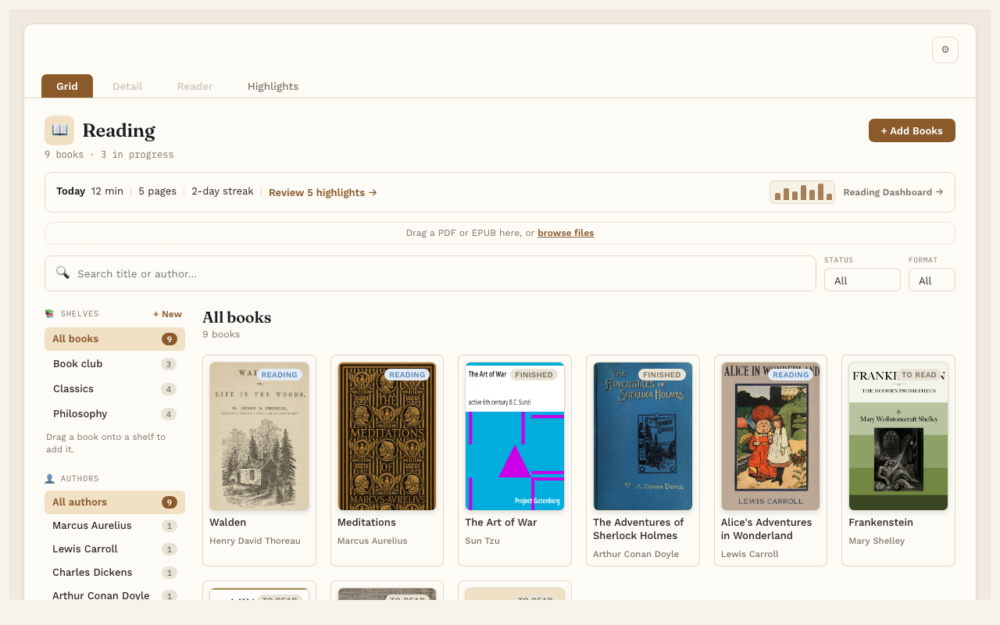
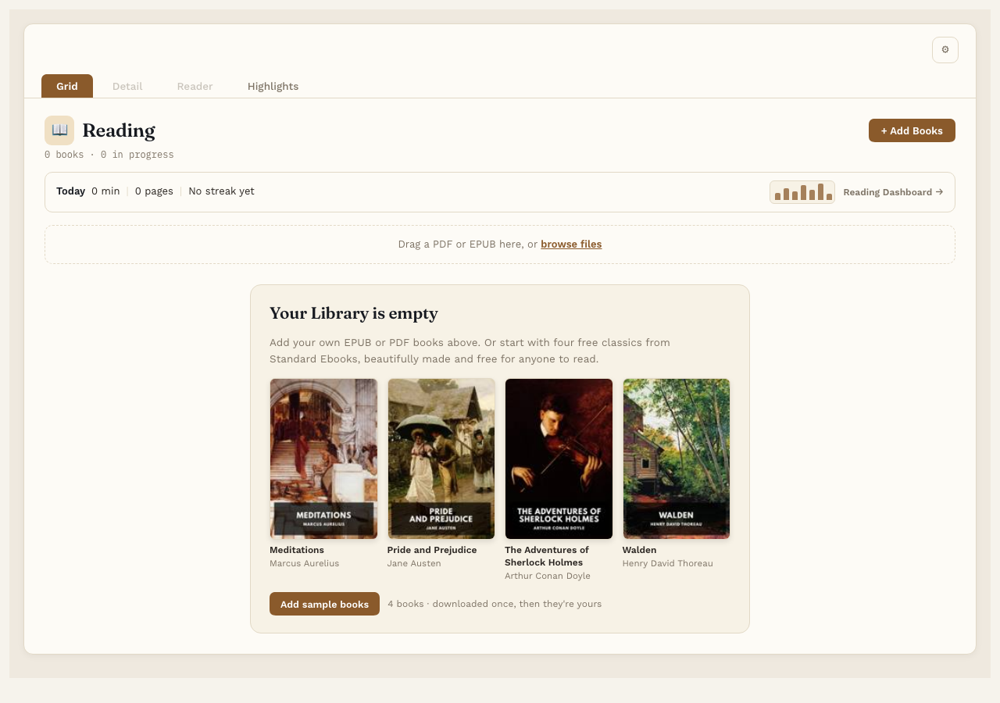
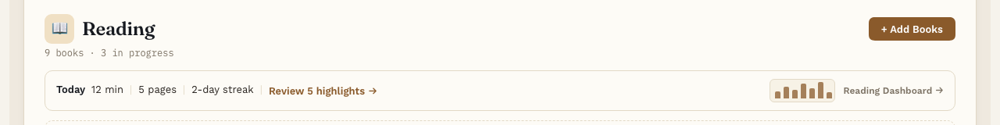

# Your Library

**Free.** Everyone gets this.

The Library shows all your books as covers. It's the **Grid** tab at the top of Reading Vault.

## Add books

- Drag EPUB or PDF files onto the box that says "Drag a PDF or EPUB here". Once you have books, it's a thin strip above the search box.
- Or press **+ Add Books** and pick one or more files.

Reading Vault fills in the title, author and cover from the file when it can. If a book is already in your Library, it tells you instead of adding it twice.

## Nothing in your Library yet?

An empty Library shows a card offering four free classics from Standard Ebooks: *Meditations*, *Pride and Prejudice*, *The Adventures of Sherlock Holmes* and *Walden*. Press **Add sample books** and they download and land on their own **Sample books** shelf, so there's something to read, highlight and listen to right away. The first time you open an empty Library, a short welcome offers the same thing. Free for everyone; the button goes away once you have any book in your Library.

## Find a book

- **Search.** Type part of a title or an author's name in the search box. The covers narrow down as you type.
- **Status.** Show only books that are To Read, Reading, Finished or Abandoned.
- **Format.** Show only EPUBs or only PDFs.
- **Authors.** Listed by last name. Click an author on the left to see just their books. The number next to each name is how many books you have by them. The heading then says "Books by" and the author's name. If a search and a filter together leave nothing, the Library says what is filtering, with a **Clear** button to show every book again.
- **Shelves.** Click a shelf on the left to see just the books on it. See [Shelves](shelves.md).

The line under the title tells you how many books you have and how many you're reading.

## Reading status

Every book has a status: To Read, Reading, Finished or Abandoned. A new book starts as To Read. When you open it, it moves to Reading on its own. You change it yourself on the book's page. See [A book's page](book-page.md).

## The Today line

At the top of the Library, just under the title, one line shows today's reading: minutes, pages and your reading streak ("No streak yet" until you've read on a day). With Pro it also opens the [Reading Dashboard](reading-dashboard.md).

## Delete a book

Open the book's page and press **Delete this book…** at the bottom of the Details box. Reading Vault asks you to confirm first. Deleting removes the book's note, its file, its cover and all its highlights, so take a moment before you confirm.

## Good to know

- Picking a cover opens that book's page. From there, press **Start reading**.
- If you edit a book's note in Obsidian, the Library updates on its own.
