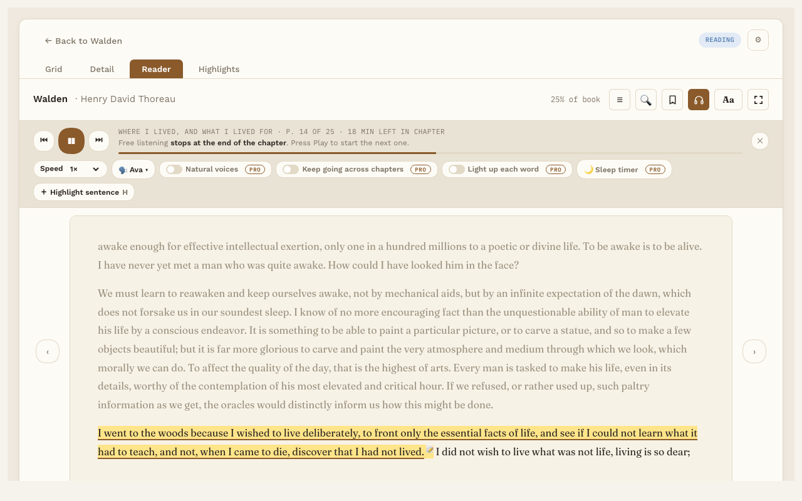

# Listen

**Free.** Everyone gets this.

Listen reads your book aloud, one sentence at a time. The sentence being read is underlined, and the page turns by itself as the voice moves on. It works for EPUB and PDF books.

Free Listen uses the voices already on your computer. On a Mac, these are the voices in System Settings, under Accessibility, Spoken Content. For natural-sounding voices that work offline, see [Natural offline voices](natural-voices.md) (Pro).

## Start and stop

- Press **Play** on the listening bar, or press the Space bar.
- Press it again to pause. Press Play once more to carry on from the same sentence. Turning pages while paused keeps it paused, and so does **Back one sentence** or **Next sentence**: it moves to that sentence, and Play reads from there.
- On a book's page, **Listen** (next to Start reading) opens the book and starts reading aloud.

If you don't see the listening bar, press the headphones button in the Reader toolbar.

## The listening bar

It sits under the book's title, in the same place for everyone. With Pro nothing moves: the PRO badges go away and those buttons start working.

- **Back one sentence** and **Next sentence.**
- A line saying where you are and how much is left, and under it the listening rule (for example, "Free listening stops at the end of the chapter").
- **Speed.** Pick 0.75×, 1×, 1.25×, 1.5×, 1.75× or 2× from the list.
- **Voice.** Pick from the voices you've ticked in Settings.
- **Natural voices, Keep going across chapters, Light up each word, Sleep timer (Pro).** The first three are switches, and each works on its own: turning one on or off never changes another. Without Pro, clicking one says what Pro adds. See [Audiobook mode](audiobook-mode.md).
- **＋ Highlight sentence.** Saves the sentence being read as a highlight. Or press **H**. If you've selected some text first, H saves the whole sentence or sentences you selected. Pressing it again on the same sentence doesn't save it twice.
- **✕** hides the listening bar. A slim reading progress strip takes its place.

## Where free listening stops

Free listening stops at the end of each chapter; press Play to start the next one. PDFs follow the same rule: a PDF with its own chapters (a contents list inside the PDF) stops at the end of each chapter, and a PDF without chapters stops after every 10 pages. The bar always says where it will stop. With Pro, listening can keep going to the end of the book.

## Jump to a sentence

While the voice is playing, click any sentence on the page and it reads from there. This works in EPUB books.

## Pick up later

Reading Vault remembers where the voice stopped. Next time you press Play in that book, it carries on from there and tells you so.

## In PDFs

Listen reads across page breaks and turns the page as it goes. It skips page numbers and the headers and footers that repeat on every page.

## Choosing voices

In Settings, under **Read aloud**, pick your reading language and tick the voices you want under **Voices to choose from**. Press ▶ to hear a sample first. Only natural-sounding computer voices are ticked to begin with; **Show all Mac voices** shows the novelty ones too. See [Settings and folders](settings.md).
