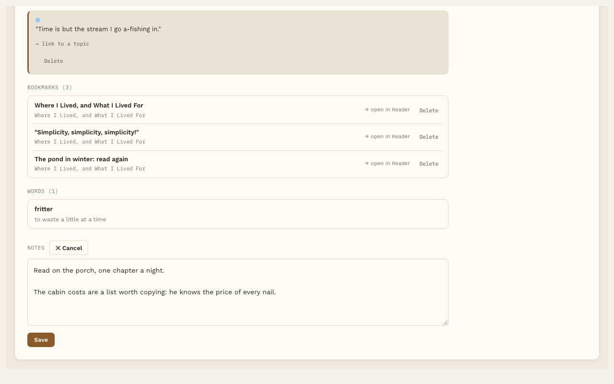

# Notes

**Free.** Everyone gets this.

Reading Vault gives you two places to write: notes on a whole book, and notes on a single highlight. Both are saved in your vault as regular notes.

## Notes on a book

1. Open the book's page.
2. Find **Notes** and press **✎ Edit**.
3. Write whatever you like, then press **Save**.

Your notes go in the book's own note, under a "Notes" heading. You can also write there directly in Obsidian. Both ways work.



## Notes on a highlight

Click any highlighted passage in the Reader, write in the **Note** box, and press **Save note**. See [Highlights](highlights.md).

## Your highlights, inside the book's note

Below your notes, each book's note gets a **Highlights** section that Reading Vault keeps up to date for you. For each highlight it shows:

- the passage and its color
- the chapter or page
- your note on it, if you wrote one
- a link that opens the Reader right at that spot

In Obsidian each highlight shows as a quote with a bar in its color. Inside the note file, one highlight looks like this:

```markdown
> [!a4-hl-green]
> "Our life is frittered away by detail."

Where I Lived, and What I Lived For · p.15 · [Open in Reader](obsidian://open-reading-highlight?hl=...)

**Note:** My calendar, exactly.
```

Reading Vault only ever changes its own Highlights section. Your writing above it is left alone.

## Turn it off

Go to Settings, then Reading Vault, and find **Highlights in the book note** under Reading. Turning it off stops future updates. It doesn't remove a section that's already there. If you turn it back on later, every book is brought up to date again.
