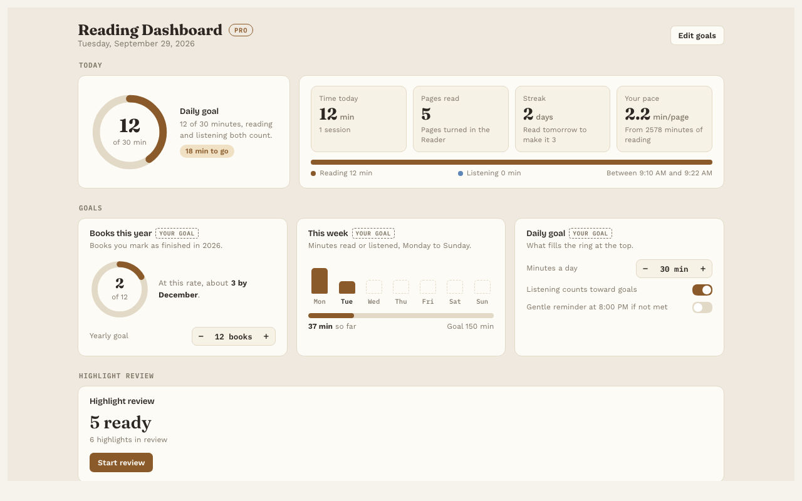

# Reading Dashboard

**Pro.** Part of Reading Vault Pro.

The Reading Dashboard shows your reading at a glance: today, your goals, your streaks and your habits over time. It fills in by itself as you read and listen.

## Open it

- Press **Reading Dashboard →** on the Today line at the bottom of the Library.
- Or press the chart icon in the ribbon on the left of Obsidian.
- Or use the command "Open reading dashboard".

## What's on it

- **Today.** Minutes, pages and your streak, with a ring for your daily goal.
- **Daily goal, This week and Books this year.** How you're doing against each goal. Books this year estimates how many you'll finish by December at your current pace.
- **A reading calendar.** Six months of days, darker on days you read more, so you can see your streaks.
- **Charts for the last 30 days.** Minutes per day (reading and listening), pages per day, and when in the day you read.
- **Books in progress,** with about how much time is left in each.
- **Highlight review.** A card that starts your daily [review](highlight-review.md).

## Set your goals

Press **Edit goals** to set minutes a day, minutes a week and books a year. You can also:

- Choose whether **listening counts toward your goals.**
- Turn on an **Evening reminder.** It's a gentle note if you haven't met your daily goal yet. It only shows while Obsidian is open.

## Count a finished book

On a book's page, press **✓ Mark as finished**. It counts toward Books this year.

## Good to know

- Your reading history is kept on your computer with the plugin's settings, never in a note and never online.
- Only real reading counts. Flipping through pages quickly isn't counted as reading.
- Without Pro, you still get the Today line in the Library.
