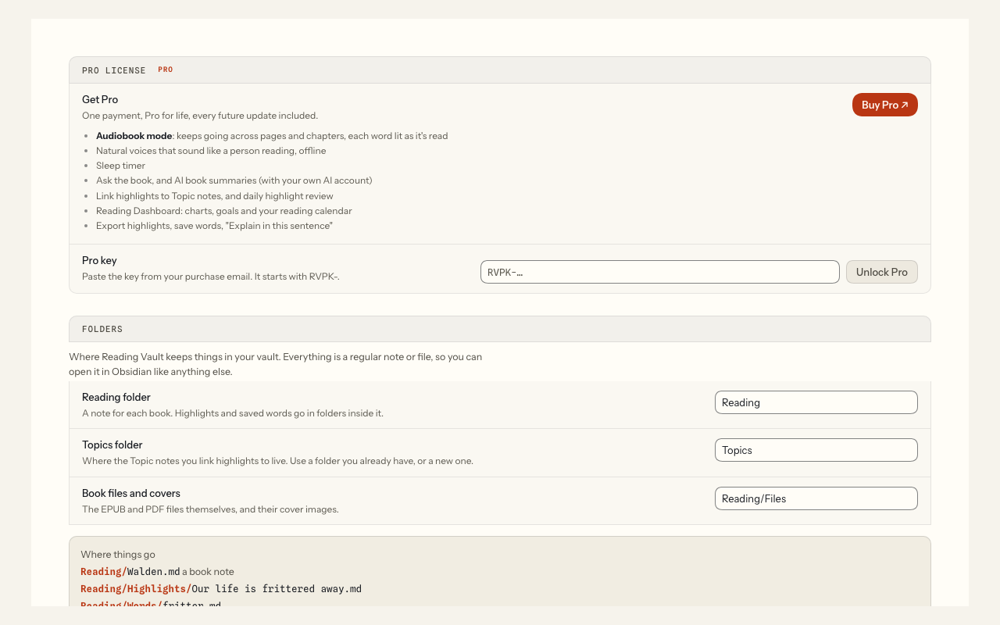

# Reading Vault Pro

**Pro.** This page is about Pro itself.

Pro is a one-time payment. You get every Pro feature for life, including every future update. There's no subscription.

## What Pro adds

- [Audiobook mode](audiobook-mode.md): listening keeps going across pages and chapters, each word lights up as it's read, and a sleep timer
- [Natural offline voices](natural-voices.md)
- [Linking highlights to Topic notes](topic-links.md)
- [Highlight review](highlight-review.md)
- [Ask the book](ask-the-book.md)
- [AI book summary](book-summary.md)
- [Reading Dashboard](reading-dashboard.md)
- [Saving words](saved-words.md), and "Explain in this sentence" in [Word lookup](word-lookup.md)
- [Export highlights](export.md)

Everything else in this manual is free.

## Get Pro

1. Go to Settings, then Reading Vault. **Pro license** is at the top.
2. Under **Get Pro**, press **Buy Pro ↗**. This opens my store, Workbench Goods, on Payhip.
3. After you pay, you'll get an email with your Pro key.

## Unlock Pro

1. Copy the key from your purchase email. It starts with **RVPK-**.
2. Paste it into the **Pro key** box.
3. Press **Unlock Pro**.

The section then says **Pro is unlocked**, with your key's number, for example "Pro key #1042".

Your key is checked on your own computer. It never goes online, and it never expires.

If a key doesn't work, a short message says why. Check you copied the whole key. If it still doesn't work, email me at jhesch@gmail.com (the message shows the same address).

## Moving to a new computer

On your old computer, go to the Pro license section and press **Remove key** (it asks you to confirm). Then unlock Pro on your new computer with the same key.

## Good to know

- Pro works in Obsidian on desktop computers only, not on phones or tablets. Tested on Mac; Windows is untested.
- If you remove your key, your notes, highlights and saved words all stay in your vault.
