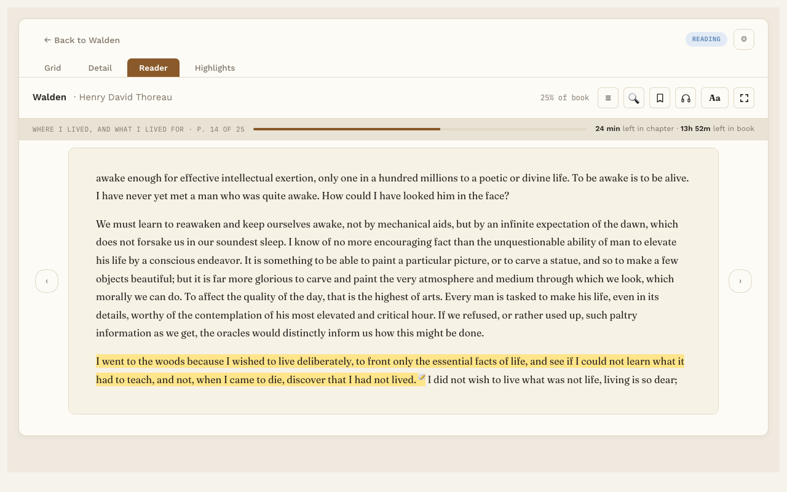
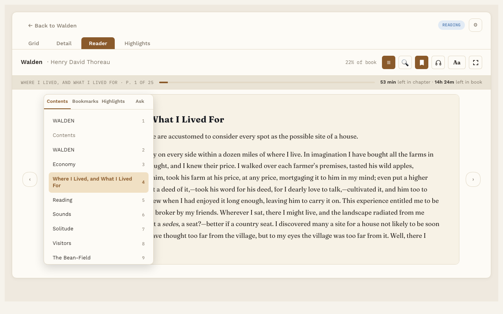

# Reading a book

**Free.** Everyone gets this.

The **Reader** tab is where you read. It works the same way for EPUB and PDF books.

## Turn pages

- Press the arrows at the sides of the page.
- Or press the Left and Right arrow keys on your keyboard.

At the end of a chapter, the next page starts the next chapter.

## Pick up where you left off

Reading Vault remembers your page. When you open the book again, you're right back there.

## The toolbar

Along the top of the Reader:

- **☰ Contents, Bookmarks and Highlights.** Opens a panel over the left of the page, with tabs for each. Contents lists the book's chapters by their own names; the title page and other front and back matter are listed too, but aren't numbered as chapters. The page underneath keeps its size, so page numbers don't change. Click any chapter, bookmark or highlight to jump there.
- **🔍 Search this book.** Find any word or phrase; each result names its chapter. Click one to jump there: the list folds away, the word is marked on the page, and **↑ ↓** (or Enter) step through the other matches. Type again to see the whole list.
- **🔖 Bookmark.** Bookmark the page you're on. See [Bookmarks](bookmarks.md).
- **Aa Text settings.** Font, size, spacing and page color. See [Text settings](text-settings.md).
- **Listen** (the headphones button). Show or hide the listening bar. See [Listen](listen.md).
- **Full screen.** Just the book, nothing else. See [Full screen](full-screen.md).

The toolbar also shows how far you are through the whole book.

## Back to where you were

When you jump somewhere, like a search result or a highlight, a small **↩ Back to p. N** button appears. Press it to go back to the page you were reading. Jumping around never changes your saved place. Only turning pages from there does.

## The reading progress strip

When the Listen bar is hidden, a slim strip takes its place. It shows the chapter name, the page within the chapter, and about how long is left in the chapter and in the book. At first the time is a rough guess. After you've read a few pages, it's based on your own reading speed.

## Keyboard shortcuts

| Key | What it does |
|---|---|
| Left and Right arrows | Turn the page |
| Space | Start or pause Listen |
| H | Save the sentence being read aloud as a highlight |
| Esc | Leave full screen |

## Good to know

- In a PDF, the Contents tab uses the PDF's own outline. If the PDF doesn't have one, you get a list of pages instead.
- In a PDF, the page is a fixed picture of the file, so text settings like font and size don't apply.
