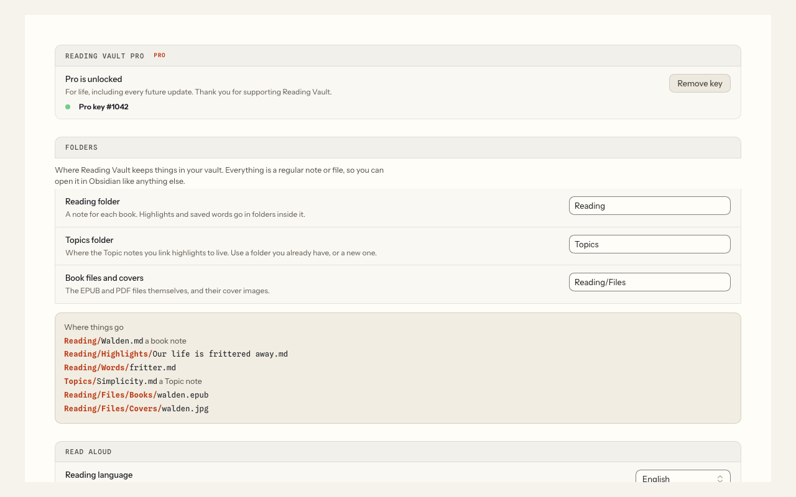
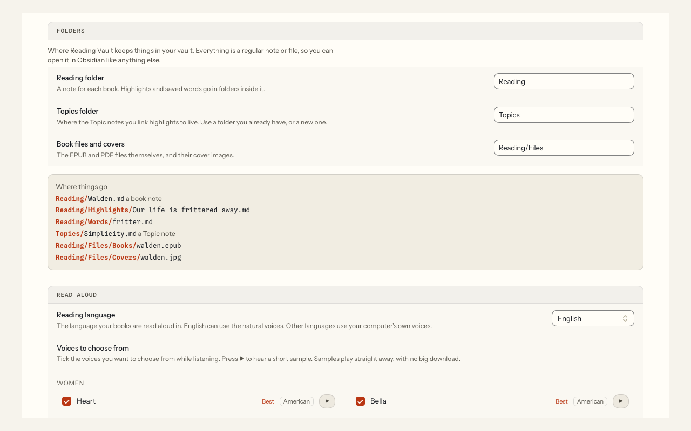

# Settings and folders

**Free.** Everyone gets this.

To open the settings, go to Obsidian's Settings, then Community plugins, then **Reading Vault**. Here's what each section does, from top to bottom.

## Reading Vault Pro

Where you unlock Pro with your key. See [Reading Vault Pro](reading-vault-pro.md).

## Folders

Choose where Reading Vault keeps things in your vault:

- **Reading folder.** A note for each book. Your highlights and saved words go in folders inside it.
- **Topics folder.** Where your Topic notes live. You can use a folder you already have.
- **Book files and covers.** The EPUB and PDF files and their cover pictures.

A new vault starts with "Reading", "Topics" and "Reading/Files". As you type, folders from your vault are suggested, and a name that isn't a folder yet is marked "(new folder)". Below the boxes, an example shows exactly where things will go.

### Changing a folder later

If the old folder already has things in it, Reading Vault first shows how many books, highlights and saved words are there. Then you choose:

- **Move them.** Everything moves to the new folder, and every link to it keeps working.
- **Go back.** Nothing changes.

Nothing is ever deleted. The old folder is left behind, empty.

## Read aloud

- **Reading language.** The language your books are in.
- **Voices to choose from.** Tick the voices you want to choose from while listening. Press ▶ to hear one. Only natural-sounding computer voices are ticked to begin with; **Show all Mac voices** shows Apple's novelty voices too.
- **Default voice.** The voice Listen starts with.
- **Natural voices (Kokoro).** Pro. With Pro, the 28 natural voices are listed first under **Voices to choose from**, already ticked, with your computer's own voices in a second group below. The one-time download (about 325 MB) is its own line under **Default voice**: press **Download (325 MB)**. Without Pro, a card lets you hear every natural voice and explains Pro. See [Natural offline voices](natural-voices.md).

## Listening

Pro. The same three settings as the listening bar's Pro buttons (changing one place changes the other):

- **Keep going across chapters.** At the end of a chapter the next one starts by itself.
- **Light up each word.** The word being read lights up inside the sentence.
- **Sleep timer.** What the 🌙 button starts with.

Without Pro they're shown switched off, with **Get Pro**. See [Audiobook mode](audiobook-mode.md).

## Reading

- **Page color.** The page color books start with: Auto, Dark or Light.
- **Highlights in the book note.** Keeps each book's note up to date with its highlights. See [Notes](notes.md).

## Highlight review

Pro. How many highlights come back each day, and whether to hide the passage until you tap it. See [Highlight review](highlight-review.md). Without Pro these are shown locked, with **Get Pro**.

## Ask the book

Pro. Turn on Ask, pick an AI service, and add your key. See [Ask the book](ask-the-book.md).

## Word lookup

Download dictionaries, and turn on **Explain in this sentence** (Pro). See [Word lookup](word-lookup.md).
