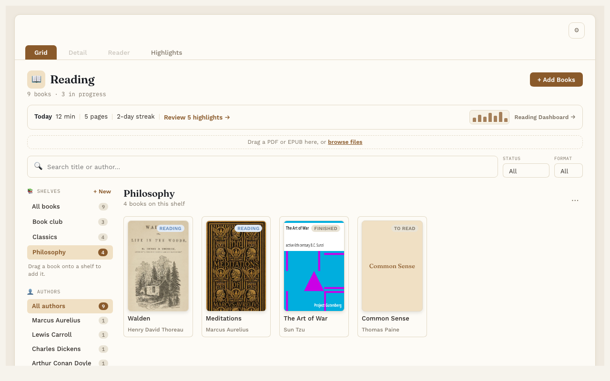

# Shelves

**Free.** Everyone gets this.

Shelves are named groups of books, like "Book club", "Stoics" or "Summer reading". A book can sit on as many shelves as you like.

## Make a shelf

1. In the Library, find **Shelves** on the left, above Authors.
2. Press **+ New**.
3. Type a name and press Enter.

## Put books on a shelf

- **Drag a cover** onto a shelf's name in the list.
- Or open the book's page and use the **Shelves** row in the Details box.

## Look at one shelf

Click a shelf's name. The Library shows only the books on it. Click **All books** to see everything again.

## Change the order

When you're looking at one shelf, drag the covers into the order you like. Reading Vault remembers it. This is great for a series.

## Rename or delete a shelf

Look at the shelf, then press **⋯** next to its name. Pick **Rename shelf** or **Delete shelf**.

Deleting a shelf never deletes a book. The books just stop being on that shelf.

## Good to know

- Shelves are one level only. A shelf can't hold another shelf.
- A book's shelves are saved in its own note. If you type a shelf name into a book's note by hand, that shelf shows up in the Library too.
