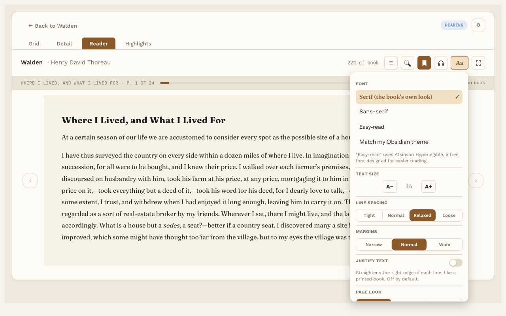

# Text settings

**Free.** Everyone gets this.

Press **Aa** in the Reader toolbar to make the page look the way you like.

## What you can change

- **Font.** Serif (the book's own look), Sans-serif, Easy-read, or Match my Obsidian theme. Easy-read uses Atkinson Hyperlegible, a font made to be easy to read, including for people with dyslexia.
- **Text size.** Press A− or A+ to make the text smaller or bigger.
- **Line spacing.** Tight, Normal, Relaxed or Loose.
- **Margins.** Narrow, Normal or Wide.
- **Justify text.** Lines the text up evenly on both sides. It's off to start with.
- **Page look.** Auto, Dark or Light. Auto follows your computer's light or dark setting.

## Good to know

- Your choices apply to every book, and Reading Vault remembers them.
- Changes show straight away, and you stay on the same text you were reading.
- For PDFs, only Page look and **Page size** work. A PDF's pages are a fixed picture of the file, so fonts and sizes can't change.
- **Page size (PDFs).** **Whole page** (the default) shows each page without scrolling. **Fit width** makes the page as wide as the Reader; scroll down to read the rest.
