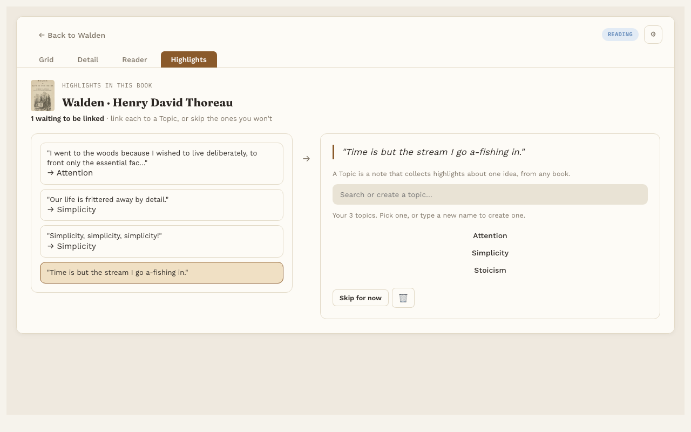

# Linking highlights to Topic notes

**Pro.** Part of Reading Vault Pro.

This is where your reading meets the rest of your vault. Link a highlight to a Topic note, and the passage becomes part of what you know about that subject, right next to your other notes.

A **Topic note** is a regular note about one subject, like "Stoicism" or "Habits". Reading Vault keeps them in your Topics folder.

## Link a highlight

1. Open the **Highlights** tab at the top of Reading Vault.
2. Pick a highlight from the list.
3. Search for a Topic note you already have, or type a new name to make one.
4. Pick it. The highlight is now linked.

Reading Vault adds a real Obsidian link from the highlight's note to the Topic note. That means it shows up in the Topic note's backlinks and in your graph.

## Unlink or skip

- **Unlink** sends a highlight back to the list, so you can link it somewhere else.
- **Skip for now** skips a highlight you don't want to link. It stays saved, it just leaves the list. **🗑** deletes it, after asking.

## One book or everything

With a book open, the Highlights tab lists that book's highlights. With no book open, it lists highlights from your whole library, each with a small cover so you know where it came from.

## Good to know

- New Topic notes are made in the Topics folder you chose in [Settings](settings.md).
- Linked highlights are the ones that come back in [Highlight review](highlight-review.md).
