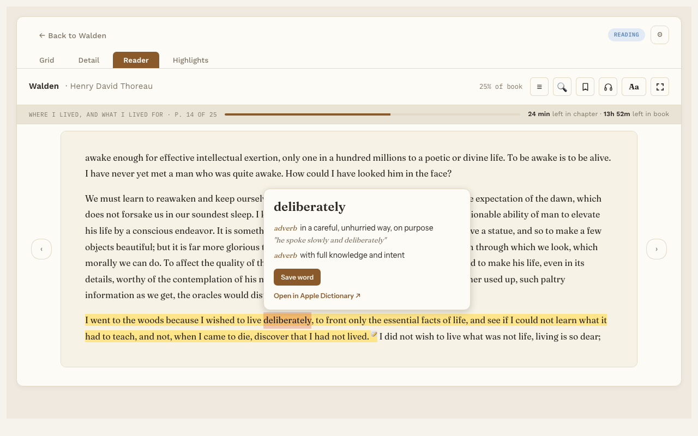

# Word lookup

**Free.** Everyone gets this. Two extras are part of Pro, and they're marked below.

Not sure what a word means? Look it up without leaving the page.

## Get the dictionary first

The dictionary lives on your computer, so lookups work offline. You download it once.

1. Go to Settings, then Reading Vault, then **Word lookup**.
2. Under **Dictionaries**, press **Download** next to the language you want.

It usually takes less than a minute. The dictionary is kept outside your vault, so it never fills up your sync.

## Dictionaries you can download

| Language | Status |
|---|---|
| English | Ready to download. From WordNet 3.1 by Princeton University. About 5.5 MB, with over 150,000 words. |
| Spanish | Coming later |
| French | Coming later |
| German | Coming later |

## Look up a word

1. Double-click a word, or select it.
2. In the small panel that appears, press **Look up**.

The card shows the word, its base form when it's different (for example "frittered" comes from *fritter*), and its meanings with examples. On a Mac, **Open in Apple Dictionary ↗** opens the same word in the Mac's own dictionary.

If you haven't downloaded a dictionary yet, the button says **Download dictionary** and takes you to Settings.

## Pro extras

- **Save word.** Keeps the word as a note in your vault, with its meaning and the sentence you found it in. See [Saving words](saved-words.md).
- **Explain in this sentence.** A short explanation of what the word means in this exact sentence, written by AI. It uses the same AI service and key as [Ask the book](ask-the-book.md), and you turn it on in Settings under Word lookup.
